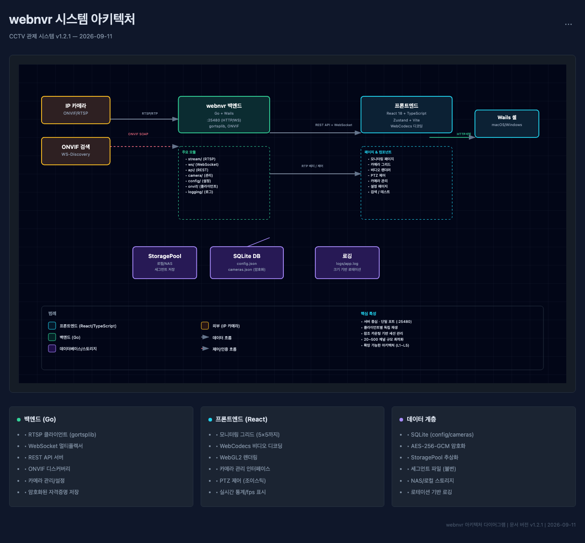

# webnvr

ONVIF 카메라 자동 검색 · 멀티뷰 실시간 스트리밍 · PTZ 제어 데스크톱 앱.

- 아키텍처 = Wails v2 셸(창) + Go 백엔드 + React/TS 프론트엔드
- 백엔드가 `:25480` 하나로 REST API(`/api/*`) + 스트림 중계 WS(`/ws`) + 프론트엔드 UI(`/`)를 모두 서빙한다
- 프론트엔드는 백엔드에 `fetch` / WebSocket 으로만 접속한다 (Wails 바인딩 미사용)
- ONVIF `네트워크 검색` 은 **백엔드 서버가 자신의 네트워크 영역에서 수행**한다 — 카메라를 찾는 대상 망은 서버 쪽이며, 접속한 클라이언트(브라우저)의 네트워크가 아니다
- 상세 설계는 `doc/architecture.md` 참조




## 사전 준비

- Go 1.27+
- Node 20+ / npm
- Wails CLI v2 (`go install github.com/wailsapp/wails/v2/cmd/wails@latest`)
- 첫 빌드 전 프론트엔드 의존성 설치 — `cd frontend && npm install`

## 실행 방법

모든 명령은 **저장소 루트**에서 실행한다 (`config/` 를 상대 경로로 읽는다).

### 1. 데스크톱 앱 + 핫 리로드 — `wails dev`

```bash
wails dev
```

Wails 창이 뜨고, 프론트엔드 변경이 즉시 반영된다. 브라우저로 디버깅하려면
`http://localhost:25480` 에 접속한다.

### 2. 백엔드만 실행 (데스크톱 창 없이)

API 테스트, 헤드리스 상주, 프론트엔드 별도 개발용.

```bash
go run ./cmd/server
# 또는 바이너리로
go build -o webnvr-server ./cmd/server && ./webnvr-server
```

- `frontend/dist` 가 있으면 `http://localhost:25480/` 로 빌드된 UI 도 함께 서빙한다
  (없으면 `/api/*` 와 `/ws` 만 제공 — `cd frontend && npm run build` 후 재실행)
- `Ctrl+C` 로 종료

데스크톱 빌드 바이너리를 창 없이 띄우려면 `-headless` 플래그를 쓴다 (터미널 실행 전용).

```bash
./build/bin/webnvr.app/Contents/MacOS/webnvr -headless
```

#### Windows 에서 백엔드 실행

백엔드(REST API + WS + UI 서빙) 는 Windows 를 정식 지원한다 (순수 Go SQLite +
디스크 여유 측정용 build-tag 로 CGO 불필요) . 창(데스크톱 앱) 버전은 Wails 전용
도구가 추가로 필요하므로, Windows 에서는 아래 헤드리스 실행을 권장한다.

1. 사전 준비 (PowerShell) 는 다음과 같다.
   - Go 1.27+ 설치 — <https://go.dev/dl/> ( 설치 후 터미널 재시작 )
   - Node 20+ 설치 — <https://nodejs.org/> ( 프론트엔드 빌드용 )
2. 저장소 루트에서 실행한다.

```powershell
# (1) 프론트엔드 빌드 — http://localhost:<포트>/ 로 UI 도 서빙하려면 1 회만 수행
cd frontend ; npm install ; npm run build ; cd ..

# (2) 바로 실행 ( 개발/테스트용 )
go run .\cmd\server

# (3) 상주용 바이너리
go build -o webnvr-server.exe .\cmd\server
.\webnvr-server.exe
```

3. 첫 실행 시 Windows Defender 방화벽이 "어플리케이션 허용" 을 물어보면 **private 네트워크 허용**
   을 선택한다. 같은 LAN 의 다른 기기에서 `http://<서버IP>:25480` 접속이 안 되면
   규칙 확인이 필요하면 아래로 포트를 허용한다.

```powershell
New-NetFirewallRule -DisplayName "webnvr" -Direction Inbound -Action Allow `
  -Protocol TCP -LocalPort 25480
```

- 종료는 `Ctrl+C` (진행 중 녹화 세그먼트는 정상 종료 경로로 flush 된다) .
- 설정/DB 는 macOS 와 동일하게 실행 위치의 `config\` 를 상대 경로로 읽는다 —
  반드시 **저장소 루트** 에서 실행할 것. 포트·바인드·자동 재바인딩 동작은 위와 같다.

### 3. 프론트엔드만 (개발 서버) — 백엔드와 독립 운영

프론트엔드는 Vite 개발 서버로 백엔드와 **따로 띄우고 따로 재시작**할 수 있다.
React/TS 소스를 수정하면 빌드 없이 브라우저에 즉시 반영된다 (HMR 핫 리로드).

```bash
cd frontend
npm install        # 첫 실행 전 1 회 — 의존성 설치
npm run dev        # http://localhost:5173
```

- **API/WS 연결 방식**: 프론트는 항상 자기 오리진(5173) 으로 `/api`, `/ws` 를 요청하고,
  Vite 프록시가 그걸 백엔드로 전달한다. 백엔드 주소를 코드에 박지 않으므로
  **백엔드 포트가 바뀌어도 프론트 코드는 손대지 않는다** — `BACKEND_PORT` 로 프록시
  대상만 지정하면 된다.

```bash
BACKEND_PORT=25480 npm run dev                    # macOS/Linux (bash/zsh)
$env:BACKEND_PORT="25480"; npm run dev           # Windows (PowerShell)
```

- `BACKEND_PORT` 미지정 시 `vite.config.ts` 의 기본값 (현재 `25480`) 을 따른다.
- 5173 이 사용 중이면 다른 포트가 자동 지정된다 (터미널 출력 확인).
- LAN 의 다른 기기에서도 `http://<서버IP>:5173` 로 개발 화면을 볼 수 있다
  (`allowedHosts` 에 등록된 도메인 — 예: `warvirus.iptime.org:5173` — 도 동작).

**독립 운영 시나리오**

| 상황 | 동작 |
|------|------|
| 백엔드 없이 프론트만 실행 | 화면은 뜬다. "N 초 후 재시도" 재연결 오버레이가 표시되고, 백엔드가 올라오면 **자동으로 연결 복구** (WS 지수 백오프 재연결 + 카메라 목록 재조회) |
| 백엔드만 재시작 (포트 변경 포함) | 프론트는 페이지를 유지한 채 재연결된다. `ws_port` 변경 시 vite 도 `BACKEND_PORT` 를 바꿔 재시작하면 된다 |
| frontend 코드만 수정 | 백엔드는 계속 동작 — 페이지 새로고침/HMR 로만 반영되고 서버 재시작이 필요 없다 |
| 백엔드 코드 수정 후 재기동 | 프론트는 그대로, WS 재연결 시점에 자동 복구 |

**프로덕션 빌드도 분리 가능**

```bash
cd frontend && npm run build     # frontend/dist 생성
```

- `frontend/dist` 가 있으면 **백엔드가 같은 포트에서 UI 를 함께 서빙**한다 (단일 오리진,
  위 포트 포워딩도 하나면 된다) — 권장 구성.
- 별도 정적 서버 (nginx, Apache 등) 에 `dist` 를 올려 **프론트만 따로 배포**할 수도 있다.
  이 경우 그 정적 서버에서 `/api` 와 `/ws`(WebSocket 업그레이드 포함) 를 백엔드로
  리버스 프록시해야 한다 — 프론트는 "같은 오리진 = 백엔드" 를 전제하기 때문이다.

## 빌드

```bash
wails build          # build/bin/webnvr.app (재배포용 프로덕션 패키지)
```

HTTPS 로 띄우려면 `WEB_CERT` / `WEB_KEY` 환경변수에 인증서 경로를 지정한다
(`run-https.sh` 참고). 이때 HTTPS/WSS 는 `server.tls_port`(기본 `8443`) 포트를 쓴다.

## 설정

`config/app.json` (최초 실행 시 기본값으로 자동 생성).

| 키 | 기본값 | 설명 |
|----|--------|------|
| `server.ws_port` | `25480` | HTTP/WS/UI 공용 포트 |
| `server.tls_port` | `8443` | HTTPS/WSS 보조 포트 (`WEB_CERT`/`WEB_KEY` 설정 시) |
| `server.bind` | `0.0.0.0` | 바인드 주소. `127.0.0.1` = 로컬 전용, `0.0.0.0` = LAN 공개 |
| `server.max_clients` | `4` | 동시 접속 제한 |
| `logging.file` | `logs/app.log` | 파일 로그 (lumberjack 로테이션) |

> `bind` 가 `0.0.0.0` 이면 인증 없이 LAN 에 노출된다. 신뢰 네트워크에서만 사용한다.

## 공유기 포트 포워딩 — 외부망에서 접속하기

서버는 `server.bind:server.ws_port` (기본 `0.0.0.0:25480`, DDNS 운영 시 `25480` 등) 에서
수신한다. 이 프로그램이 **공유기 내부(사설 IP)** 에서 돌면 외부 인터넷에서는 도달할 수
없으므로, iptime 공유기에 **포트 포워딩** 규칙을 추가해 내부 서버 PC로 연결을 전달해야 한다.

> **순수 내부망에서 쓸 때는 이 섹션 전체가 불필요하다.** 같은 LAN 안의 모든 클라이언트는
> 공유기 개입 없이 서버의 내부 IP 로 곧장 접속한다 — 예: `http://192.168.0.217:25480`.
> 아래 절차는 **외부(인터넷) 에서 내부 서버로** 접근할 때만 필요하다.

### 0. 사전 확인

| 항목 | 확인 방법 |
|------|-----------|
| 서버 포트/내부 IP | 서버 로그의 `LAN 접속 가능: http://192.168.x.x:<포트>` 줄 (기동 시 출력) |
| 공유기 관리자 | 내부 브라우저에서 `http://192.168.0.1` 접속 (아이디/비밀번호는 공유기 설정 시 지정한 값) |
| DDNS | `your_id.iptime.org` 처럼 공유기 DDNS 설정이 활성화돼 있어야 한다 |
| 공인 IP 여부 | 공유기 상태 정보의 **WAN IP** 와 외부 "내 IP" 검색 사이트의 값이 같아야 한다. `100.64.x.x` ~ `100.127.x.x` 등 사설 대역이면 ISP 가 CGNAT 를 쓰는 것 — 포워딩으로도 외부 접속이 불가하니 ISP 에 공인 IP 를 요청해야 한다 |

### 1. 내부 IP 고정 (DHCP 예약)

서버 PC 의 IP 가 재부팅/DHCP 갱신으로 바뀌면 포워딩이 끊긴다. 공유기에서 IP 를 고정한다.

1. `http://192.168.0.1` → **고급 설정 → 관리 → DHCP 서비스** (모델에 따라 `초기화/관리` 또는 `LAN → DHCP` )
2. **DHCP 예약(고정 IP)** 목록에서 서버 PC 의 MAC 주소를 찾아 원하는 내부 IP (예 `192.168.0.217`) 로 예약
3. 적용 후 서버 PC 를 한 번 재연결해 예약된 IP 를 받는 것을 확인

### 2. 포트 포워딩 규칙 추가

1. `http://192.168.0.1` → **고급 설정 → NAT/라우터 관리 → 포트포워드 설정**
2. 아래 값으로 규칙을 추가한다 (HTTP 가 `25480` 예시).

   | 항목 | 값 | 설명 |
   |------|----|------|
   | 서비스 이름 | `webnvr` | 식별용 임의 문자열 |
   | 프로토콜 | `TCP` | HTTP/WS 모두 TCP 하나면 충분 |
   | 외부 포트 | `25480` | 외부에서 쓸 포트 (`ws_port` 와 동일하게 두면 단순) |
   | 내부 IP | `192.168.0.217` | 1 번에서 고정한 서버 PC 의 IP |
   | 내부 포트 | `25480` | `ws_port` |
   | 적용 | ☑ 활성화 | |

3. **적용** — 공유기 재부팅 없이 즉시 반영된다.
4. HTTPS(`WEB_CERT`/`WEB_KEY`) 도 외부에 열려면 같은 방식으로 `tls_port`(기본 `8443`) 규칙을 하나 더 추가한다.
5. 개발용 vite 서버(5173) 도 외부에서 쓰려면 `5173 → 192.168.0.217:5173` 규칙을 추가한다.

### 3. 접속 확인

```bash
# 외부 회선 (스마트폰 LTE 등, 공유기 망 밖) 에서
curl http://your_id.iptime.org:25480/api/health
# → {"ok":true,"version":1}
```

- 브라우저: `http://your_id.iptime.org:25480` → 로그인 없이 모니터링 화면이 뜨면 성공
- **내부망에서 도메인 접속은 공유기 NAT 루프백 지원 여부에 따라 동작이 갈린다.**
  실패하면 내부에서는 `http://192.168.0.217:25480` 로 접속하면 된다.
- 안 되면 확인 순서는 다음과 같다. ①서버가 `0.0.0.0` 으로 바인드됐는지 (`bind` 설정) ②공유기 포트포워드
  규칙의 내부 IP/포트 오탈자 ③macOS 방화벽이 활성이면 `시스템 설정 → 네트워크 → 방화벽`
  에서 수신 허용 ④CGNAT 여부 (0 번 항목).

- 메인화면
  <image src="./doc/main1.png"/>
- 검색화면-달력
  <image src="./doc/search1.png"/>
- 검색화면
  <image src="./doc/search2.png"/>
- 카메라설정
  <image src="./doc/setting1.png"/>
- 기본설정
  <image src="./doc/setting2.png"/>
- 실행화면
<video controls width="100%">
  <source src="./doc/webnvr4.mp4" type="video/mp4">
</video>

### 4. 포트 변경 시

- 앱 설정 화면에서 `ws_port` 를 저장하면 서버가 **자동으로 새 포트에 재바인딩**한다
  (프론트는 새 포트로 자동 이동).
- 다만 공유기의 포트 포워딩 규칙은 코드와 무관하므로, **외부 포트/내부 포트를 새 값에
  맞춰 직접 수정**해야 한다.

### 5. 보안 경고 

- 현재 서버에는 **인증이 없다** (JWT 는 Phase 6.1 계획). 포트 포워딩이 활성화된 동안
  인터넷의 누구나 카메라 영상 열람 · PTZ 제어 · 설정 변경을 할 수 있다.
- 권장: ① 쓸 때만 포워딩을 켜고 끄기 ②장기 운영은 공유기 **VPN 서버** 기능으로
  외부에서 내부망 접근 (포워딩 불필요) ③Phase 6.1 인증 구현 후 개방.
